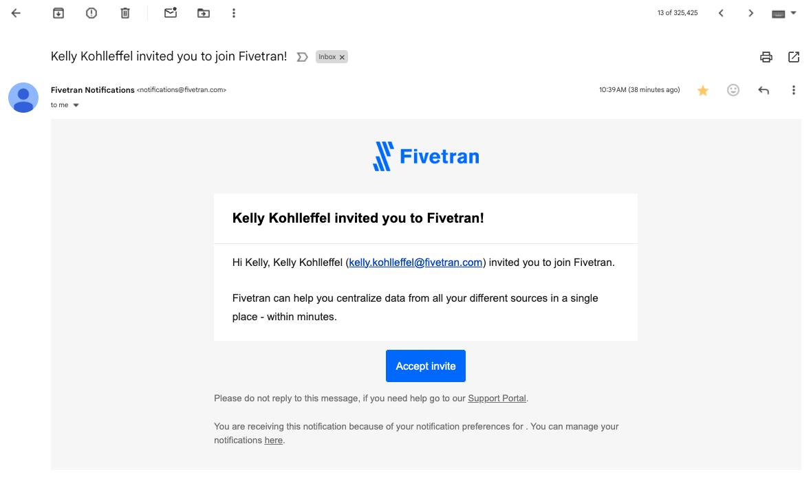

# :wine_glass: Create a wine country travel assistant with Fivetran, Snowflake, Cortex, and Streamlit NEW!
## Scripts and code for the Fivetran + Snowflake RAG-based, Gen AI Hands on Lab (75 minutes)

This repo provides the high-level steps to create a RAG-based, Gen AI travel assistant using Fivetran and Snowflake (detailed instructions are in the lab guide provided by your lab instructor). The required transformation scripts and the required Streamlit code are both included. This repo is the "easy button" to copy/paste the transformations and the code. If you have any issues with copy/paste, you can download the code [here](https://github.com/kellykohlleffel/genai-rag-snowflake/archive/refs/heads/main.zip).

> **Note**: The updates to this repo from the original genai_rag_snowflake repo are focused on the Streamlit in Snowflake data app:

1. Added **`claude-3-5-sonnet`** to the Cortex model selection dropdown in the sidebar.
2. Added an **enhanced winery/vineyard search function** and **2 preset prompts** in the sidebar.
    * The winery/vineyard dropdown search feature provides an alphabetized list of 700+ California wineries with type-to-search functionality for quick location of specific wineries.
    * The winery overview preset generates a structured profile covering key aspects like location, history, specialties, experiences, hospitality, awards and pricing - all tailored to the selected winery from the dropdown.
    * The trip plan preset creates a complete 2-day wine country itinerary centered around the selected winery, including nearby dining, accommodations, activities, and practical tips for making the most of the visit.

### STEP 0: Prerequisite - Access the Fivetran lab account

* For this hands-on workshop, we have provisioned you into a Fivetran Account specifically for this lab. Let’s access it now.

* Access the email account that you provided for this lab and look for an email from notifications@fivetran.com that was sent to you today - it will look like this:



* If you **DO NOT** already have a Fivetran account, click on the Accept Invite link and you will be sent to the Fivetran sign-up page for the lab account. Note that Fivetran requires at least a 12-CHARACTER PASSWORD. Once you’ve entered your information, click Sign up.

* If you **DO** already have a Fivetran account, follow these steps:
    * Accept invite from email
    * **Switch Account** to **Fivetran_HoL** by clicking "Switch account" in the upper left of your Fivetran UI
    * Login to Fivetran_HoL
        * Select forgot password
        * Go to the email for password reset (from fivetran)
        * Set password
        * Login

### STEP 1: Create a Fivetran connector to Snowflake

* **Source**: `Google Cloud PostgreSQL`
* **Fivetran Destination**: `SNOWFLAKE_LLM_LAB_X`
* **Destination Schema prefix (connector name)**: `yourlastname` 
* **Host**: `34.94.122.157` **(NOTE - see the lab guide or your email for credentials and additional host identifiers)**
```
34.94.122.157
```
* **Data source sync selections:**
    * **Schema**: `agriculture`
    * **Table**: `california_wine_country_visits`

### STEP 2: View the new dataset in Snowflake Snowsight

* **Snowflake Account**: **https://dma21732.snowflakecomputing.com** **(NOTE - see the lab guide or your email for credentials)**
* **Snowflake Database**: `HOL_DATABASE`
* **Schema**: `yourlastname_agriculture`
* **Table**: `california_wine_country_visits`
* Click on **Data Preview** to take a look

### STEP 3: Transform the new structured dataset into a single string to simulate an unstructured document
* Open a New Worksheet in **Snowflake Snowsight** (left gray navigation under Projects)
* Make sure you set the worksheet context at the top: **HOL_DATABASE** and **yourlastname_agriculture** schema name
* Copy and paste these [**transformation scripts**](01-transformations.sql) in your Snowsight worksheet
* Highlight only the first transformation script in the editor and click run
* This will create a new winery_information table using the CONCAT function. Each multi-column record (winery or vineyard) will now be a single string (creates an "unstructured" document for each winery or vineyard)

```sql
/** Transformation #1 - Create the vineyard_data_single_string table using concat and prefixes for columns (creates an "unstructured" doc for each winery/vineyard)
/** Create each winery and vineyard review as a single field vs multiple fields **/
CREATE OR REPLACE TABLE vineyard_data_single_string AS 
    SELECT WINERY_OR_VINEYARD, CONCAT(
        'The winery name is ', IFNULL(WINERY_OR_VINEYARD, ' Name is not known'), '.',
        ' Wine region: ', IFNULL(CA_WINE_REGION, 'unknown'),
        ' The AVA Appellation is the ', IFNULL(AVA_APPELLATION_SUB_APPELLATION, 'unknown'), '.',
        ' The website associated with the winery is ', IFNULL(WEBSITE, 'unknown'), '.',
        ' The price range is ', IFNULL(PRICE_RANGE, 'unknown'), '.',
        ' Tasting Room Hours: ', IFNULL(TASTING_ROOM_HOURS, 'unknown'), '.',
        ' The reservation requirement is: ', IFNULL(RESERVATION_REQUIRED, 'unknown'), '.',
        ' Here is a complete description of the winery or vineyard: ', IFNULL(WINERY_DESCRIPTION, 'unknown'), '.',
        ' The primary varietal this winery offers is ', IFNULL(PRIMARY_VARIETALS, 'unknown'), '.',
        ' Thoughts on the Tasting Room Experience: ', IFNULL(TASTING_ROOM_EXPERIENCE, 'unknown'), '.',
        ' Amenities: ', IFNULL(AMENITIES, 'unknown'), '.',
        ' Awards and Accolades: ', IFNULL(AWARDS_AND_ACCOLADES, 'unknown'), '.',
        ' Distance Travel Time considerations: ', IFNULL(DISTANCE_AND_TRAVEL_TIME, 'unknown'), '.',
        ' User Rating: ', IFNULL(USER_RATING, 'unknown'), '.',
        ' The secondary varietal for this winery is: ', IFNULL(SECONDARY_VARIETALS, 'unknown'), '.',
        ' Wine Styles for this winery are: ', IFNULL(WINE_STYLES, 'unknown'), '.',
        ' Events and Activities: ', IFNULL(EVENTS_AND_ACTIVITIES, 'unknown'), '.',
        ' Sustainability Practices: ', IFNULL(SUSTAINABILITY_PRACTICES, 'unknown'), '.',
        ' Social Media Channels: ', IFNULL(SOCIAL_MEDIA, 'unknown'), '.',
        ' The address is ', 
            IFNULL(ADDRESS, 'unknown'), ', ',
            IFNULL(CITY, 'unknown'), ', ',
            IFNULL(STATE, 'unknown'), ', ',
            IFNULL(ZIP, 'unknown'), '.',
        ' The Phone Number is ', IFNULL(PHONE, 'unknown'), '.',
        ' Winemaker: ', IFNULL(WINEMAKER, 'unknown'),
        ' Did Kelly Kohlleffel recommend this winery?: ', IFNULL(KELLY_KOHLLEFFEL_RECOMMENDED, 'unknown')
    ) AS winery_information
    FROM california_wine_country_visits;

/** Transformation #2 - Using the Snowflake Cortex EMBED_TEXT_1024 LLM function, this transformation creates embeddings from the newly created vineyard_data_single_string table and creates a vector table called winery_embedding.
/** Create the vector table from the wine review single field table **/
      CREATE or REPLACE TABLE vineyard_data_vectors AS 
            SELECT winery_or_vineyard, winery_information, 
            snowflake.cortex.EMBED_TEXT_1024('snowflake-arctic-embed-l-v2.0', winery_information) as WINERY_EMBEDDING 
            FROM vineyard_data_single_string;

/** Select a control record to see the LLM-friendly "text" document table and the embeddings table **/
    SELECT *
    FROM vineyard_data_vectors
    WHERE winery_information LIKE '%winery name is Kohlleffel Vineyards%';

```

### STEP 4: Create the embeddings and the vector table from the winery_information single string table
* Highlight only the second transformation script in your Snowflake Snowsight worksheet and click run
* This will create your embeddings and a vector table that will be referenced later by Cortex LLM functions and your Streamlit application

```sql
/** Transformation #2 - Using the Snowflake Cortex EMBED_TEXT_1024 LLM function, this transformation creates embeddings from the newly created vineyard_data_single_string table and creates a vector table called winery_embedding.
/** Create the vector table from the wine review single field table **/
      CREATE or REPLACE TABLE vineyard_data_vectors AS 
            SELECT winery_or_vineyard, winery_information, 
            snowflake.cortex.EMBED_TEXT_1024('snowflake-arctic-embed-l-v2.0', winery_information) as WINERY_EMBEDDING 
            FROM vineyard_data_single_string;
```

### STEP 5: Run a SELECT statement to check out the LLM-friendly "text" document table and embeddings table
* Highlight only the third script **SELECT * FROM vineyard_data_vectors WHERE winery_information LIKE '%winery name is Kohlleffel Vineyards%';** in your Snowflake Snowsight worksheet and click run
* This will show you the complete results of the 2 transformations that you just ran

```sql
/** Select a control record to see the LLM-friendly "text" document table and the embeddings table **/
    SELECT *
    FROM vineyard_data_vectors
    WHERE winery_information LIKE '%winery name is Kohlleffel Vineyards%';
```

### STEP 6: Create the a Streamlit app and build a Visit Assistant Chatbot
* Open a New Streamlit application in Snowflake Snowflake (left gray navigation under Projects)
* Make sure you set the Streamlit app context: **HOL_DATABASE** and **yourlastname_agriculture** schema name
* Highlight the "hello world" Streamlit code and delete it
* Click Run to clear the preview pane
* Copy and paste the [**Streamlit code**](02-streamlit-code.py) in the Streamlit editor

```python
#
# Fivetran Snowflake Cortex Streamlit Lab
# Build a California Wine Country Travel Assistant Chatbot
#

import streamlit as st
from snowflake.snowpark.context import get_active_session
import pandas as pd
import time

# Change this list as needed to add/remove model capabilities.
MODELS = [
    "llama3.2-3b",
    "claude-3-5-sonnet",
    "mistral-large2",
    "llama3.1-8b",
    "llama3.1-405b",
    "llama3.1-70b",
    "mistral-7b",
    "jamba-1.5-large",
    "mixtral-8x7b",
    "reka-flash",
    "gemma-7b"
]

# Change this value to control the number of tokens
CHUNK_NUMBER = [4,6,8,10,12,14,16]

# Preset prompts
WINERY_OVERVIEW_PROMPT = """Create a well-formatted comprehensive overview of the following winery:

**Winery Name:** {winery}

The overview should include:

1. **Basic Information**:
   - Location, including region and any notable geographical features.
   - A brief history of the winery (e.g., founding date, founders, or mission).
   - Specialties in wine production (e.g., types of wine, signature varietals).

2. **Unique Characteristics and Offerings**:
   - At least 5 unique features, activities, or experiences the winery offers.
   - Any seasonal or recurring events.

3. **Tasting Room and Tours**:
   - Details about the tasting room ambiance.
   - Information about guided tours, tastings, or other experiences.

4. **Hospitality**:
   - Unique amenities, such as picnic areas, accommodations, or partnerships.
   - Pet and children policies and details.

5. **Notable Recognition**:
   - Awards, certifications, or mentions in media.

6. **Pricing**:
   - Cost range for tastings, tours, or special events.

7. **Insider Tips**:
   - Recommendations for visitors to make the most of their experience."""

TRIP_PLAN_PROMPT = """Create a well-formatted, detailed and engaging travel guide for a 2-day wine country getaway, complete with a catchy itinerary name. The trip should include visits to {winery}.

Please include:
1. A unique name for this winery trip
2. A logical day-by-day itinerary that visits the winery
3. At least 5 unique characteristics or activities at the winery
4. Recommended nearby restaurants for lunch and dinner
5. Hotel recommendations for the overnight stay
6. Other complementary activities
7. Information about any pet-friendly features
8. Tips for making the most of the visits
9. Advice on what to wear for this time of year
10. Estimated cost of the trip"""

def get_winery_list(session):
    """Fetch the list of wineries from Snowflake."""
    winery_cmd = """
    SELECT DISTINCT winery_or_vineyard 
    FROM vineyard_data_vectors 
    ORDER BY winery_or_vineyard
    """
    winery_df = session.sql(winery_cmd).to_pandas()
    return winery_df['WINERY_OR_VINEYARD'].tolist()

def on_preset_prompt_change():
    """Handle preset prompt changes"""
    if st.session_state.preset_prompt == "None":
        # Clear both the full and display questions when None is selected
        st.session_state.current_question = None
        st.session_state.display_question = None
    elif st.session_state.selected_winery:
        if st.session_state.preset_prompt == "Winery Overview":
            # Store the full prompt for processing
            st.session_state.current_question = WINERY_OVERVIEW_PROMPT.format(winery=st.session_state.selected_winery)
            # Store the simplified display version
            st.session_state.display_question = f"Create a well-formatted comprehensive overview of {st.session_state.selected_winery}"
        else:
            # Store the full prompt for processing
            st.session_state.current_question = TRIP_PLAN_PROMPT.format(winery=st.session_state.selected_winery)
            # Store the simplified display version
            st.session_state.display_question = f"Create a well-formatted, detailed and engaging travel guide for a 2-day wine country getaway, complete with a catchy itinerary name. The trip should include visits to {st.session_state.selected_winery}."
    
def build_layout():
    # Initialize session state
    if 'conversation_state' not in st.session_state:
        st.session_state.conversation_state = []
    if 'current_question' not in st.session_state:
        st.session_state.current_question = None
    if 'reset_key' not in st.session_state:
        st.session_state.reset_key = 0

    # Set page config - must be called first
    st.set_page_config(layout="wide")

    # Build the layout
    st.title(":wine_glass: California Wine Country Visit Assistant :wine_glass:")
    st.write("""I'm an interactive California Wine Country Visit Assistant. A bit about me...I'm a RAG-based, Gen AI app **built 
      with and powered by Fivetran, Snowflake, Streamlit, and Cortex** and I use a custom, structured dataset!""")
    st.caption("""Let me help plan your trip to California wine country. Using the dataset you just moved into the Snowflake Data Cloud with Fivetran, I'll assist you with winery and vineyard information and provide visit recommendations from numerous models available in Snowflake Cortex (including Claude 3.5 Sonnet). You can even pick the model you want to use or try out all the models. The dataset includes over 700 wineries and vineyards across all CA wine-producing regions including the North Coast, Central Coast, Central Valley, South Coast and various AVAs sub-AVAs. Let's get started!""")

    # Sidebar components
    st.sidebar.selectbox("Select a Snowflake Cortex model:", MODELS, key="model_name")
    st.sidebar.checkbox('Use your Fivetran dataset as context?', key="dataset_context")

    # Winery search feature
    wineries = get_winery_list(session)
    st.sidebar.selectbox(
        "Search for a specific winery:",
        options=[""] + wineries,  # Add empty option as first choice
        key="selected_winery",
        help="Type to search for a specific winery"
    )

    # Preset prompt selection
    if st.session_state.get('selected_winery') and st.session_state.get('selected_winery') != "":
        st.sidebar.radio(
            "Select a preset prompt:",
            options=["None", "Winery Overview", "Trip Plan"],
            key="preset_prompt",
            on_change=on_preset_prompt_change,
            help="Select a preset prompt to generate information about the selected winery"
        )

    # Reset conversation button
    if st.button('Reset conversation'):
        st.session_state.conversation_state = []
        st.session_state.current_question = None
        st.session_state.display_question = None
        st.session_state.reset_key += 1  # Add this
        st.rerun()

    # Advanced options
    with st.sidebar.expander("Advanced Options"):
        st.selectbox("Select number of context chunks:", CHUNK_NUMBER, key="num_retrieved_chunks")

    # Sidebar caption and logo
    st.sidebar.caption("""I use **Snowflake Cortex** which provides instant access to industry-leading large language models including Claude, Llama, and Snowflake Arctic that have been trained by researchers at companies like Anthropic, Meta, Mistral, Google, Reka, and Snowflake.""")
    for _ in range(6):
        st.sidebar.write("")
    url = 'https://i.imgur.com/9lS8Y34.png'
    col1, col2, col3 = st.sidebar.columns([1,2,1])
    with col2:
        st.image(url, width=150)
    caption_col1, caption_col2, caption_col3 = st.sidebar.columns([0.22,2,0.005])
    with caption_col2:
        st.caption("Fivetran, Snowflake, Streamlit, & Cortex")

    # Main content area
    processing_placeholder = st.empty()
    text_input = st.text_input(
        "",
        placeholder="Message your personal CA Wine Country Visit Assistant...",
        key=f"text_input_{st.session_state.reset_key}",  # Modify this
        label_visibility="collapsed"
    )

    # Dataset context caption
    if st.session_state.dataset_context:
        st.caption("""Please note that :green[**_I am_**] using your Fivetran dataset as context. All models are very 
          creative and can make mistakes. Consider checking important information before heading out to wine country.""")
    else:
        st.caption("""Please note that :red[**_I am NOT_**] using your Fivetran dataset as context. All models are very 
          creative and can make mistakes. Consider checking important information before heading out to wine country.""")

    # Return the text input if no preset prompt is selected, otherwise return the preset prompt
    return text_input if st.session_state.get('preset_prompt') == "None" or not st.session_state.get('current_question') else st.session_state.current_question

def build_prompt(question):
    # Build the RAG prompt if the user chooses
    chunks_used = []
    if st.session_state.dataset_context:
        context_cmd = f"""
          with context_cte as
          (select winery_or_vineyard, winery_information as winery_chunk, vector_cosine_similarity(winery_embedding,
                snowflake.cortex.embed_text_1024('snowflake-arctic-embed-l-v2.0', ?)) as v_sim
          from vineyard_data_vectors
          having v_sim > 0
          order by v_sim desc
          limit ?)
          select winery_or_vineyard, winery_chunk from context_cte 
          """
        chunk_limit = st.session_state.num_retrieved_chunks
        context_df = session.sql(context_cmd, params=[question, chunk_limit]).to_pandas()
        context_len = len(context_df) -1
        chunks_used = context_df['WINERY_OR_VINEYARD'].tolist()
        
        rag_context = ""
        for i in range(0, context_len):
            rag_context += context_df.loc[i, 'WINERY_CHUNK']
        rag_context = rag_context.replace("'", "''")
        
        new_prompt = f"""
          Act as a California winery visit expert for visitors to California wine country who want an incredible visit and 
          tasting experience. You are a personal visit assistant named Snowflake CA Wine Country Visit Assistant. Provide 
          the most accurate information on California wineries based only on the context provided. Only provide information 
          if there is an exact match below. Do not go outside the context provided.  
          Context: {rag_context}
          Question: {question} 
          Answer: 
          """
    else:
        new_prompt = f"""
          Act as a California winery visit expert for visitors to California wine country who want an incredible visit and 
          tasting experience. You are a personal visit assistant named Snowflake CA Wine Country Visit Assistant. Provide 
          the most accurate information on California wineries.
          Question: {question} 
          Answer: 
          """

    return new_prompt, chunks_used

def get_model_token_count(prompt_or_response) -> int:
    token_count = 0
    try:
        token_cmd = f"""select SNOWFLAKE.CORTEX.COUNT_TOKENS(?, ?) as token_count;"""
        tc_data = session.sql(token_cmd, params=[st.session_state.model_name, prompt_or_response]).collect()
        token_count = tc_data[0][0]
    except Exception:
        token_count = -9999

    return token_count

def calc_times(start_time, first_token_time, end_time, token_count):
    time_to_first_token = first_token_time - start_time
    total_duration = end_time - start_time
    time_for_remaining_tokens = total_duration - time_to_first_token
    
    tokens_per_second = token_count / total_duration if total_duration > 0 else 1
    
    if time_to_first_token < 0.01:
        time_to_first_token = total_duration / 2

    return time_to_first_token, time_for_remaining_tokens, tokens_per_second

def run_prompt(question):
    formatted_prompt, chunks_used = build_prompt(question)
    token_count = get_model_token_count(formatted_prompt)
    start_time = time.time()
    
    cortex_cmd = f"""
             select SNOWFLAKE.CORTEX.COMPLETE(?,?) as response
           """    
    sql_resp = session.sql(cortex_cmd, params=[st.session_state.model_name, formatted_prompt])
    first_token_time = time.time()
    answer_df = sql_resp.collect()
    end_time = time.time()
    
    time_to_first_token, time_for_remaining_tokens, tokens_per_second = calc_times(
        start_time, first_token_time, end_time, token_count)

    return answer_df, time_to_first_token, time_for_remaining_tokens, tokens_per_second, int(token_count), chunks_used

def main():
    question = build_layout()
    
    if question:
        with st.spinner("Thinking..."):
            try:
                # Run the prompt using the full question
                data, time_to_first_token, time_for_remaining_tokens, tokens_per_second, token_count, chunks_used = run_prompt(question)
                response = data[0][0]
                
                if response:
                    token_count += get_model_token_count(response)
                    rag_delim = ", "
                    
                    # Use the display question if it exists, otherwise use the original question
                    display_question = st.session_state.get('display_question') if st.session_state.get('display_question') else question
                    
                    # Append conversation state
                    st.session_state.conversation_state.append(
                        (f":information_source: RAG Chunks/Records Used:",
                         f"""<span style='color:#808080;'> {(rag_delim.join([str(ele) for ele in chunks_used])) if chunks_used else 'none'} 
                         </span><br/><br/>""")
                    )
                    st.session_state.conversation_state.append(
                        (f":1234: Token Count for '{st.session_state.model_name}':", 
                         f"""<span style='color:#808080;'>{token_count} tokens :small_blue_diamond: {tokens_per_second:.2f} tokens/s :small_blue_diamond: 
                         {time_to_first_token:.2f}s to first token + {time_for_remaining_tokens:.2f}s.</span>""")
                    )
                    st.session_state.conversation_state.append(
                        (f"CA Wine Country Visit Assistant ({st.session_state.model_name}):", response)
                    )
                    st.session_state.conversation_state.append(("You:", display_question))
                    
                    # Clear the current questions after processing
                    st.session_state.current_question = None
                    st.session_state.display_question = None
                    
            except Exception as e:
                st.warning(f"An error occurred while processing your question: {e}")
                
        # Display conversation history
        if st.session_state.conversation_state:
            for i in reversed(range(len(st.session_state.conversation_state))):
                label, message = st.session_state.conversation_state[i]
                if 'Token Count' in label or 'RAG Chunks' in label:
                    st.markdown(f"**{label}** {message}", unsafe_allow_html=True)
                elif i % 2 == 0:
                    st.write(f":wine_glass:**{label}** {message}")
                else:
                    st.write(f":question:**{label}** {message}")

if __name__ == "__main__":
    session = get_active_session()
    main()
```

### Step 7: Have some fun checking out the travel assistant features and creating prompts for unique visits using RAG
* Check out the key features of the application and test the Streamlit application with your own prompts or check out the sample prompts below.

* Key features

    * Choose the Snowflake Cortex LLM (model) that you want the Assistant (and Snowflake Cortex) to use. Snowflake Cortex LLM functions and models are specific to each Snowflake region. Our lab is running in aws-us-west2. [Here are the Snowflake Cortex LLMs that are available by region](https://docs.snowflake.com/en/user-guide/snowflake-cortex/llm-functions#availability).

    * You can toggle between the Assistant **“using”** or **“not using”** your new Fivetran dataset as context (use Retrieval Augmented Generation, RAG, or don't use RAG). If you choose NOT to use RAG and the new Fivetran dataset as context, the models will be operating solely from their original training dataset.

    * Advanced options: The **“Select number of context chunks”** setting allows you to control how many chunks/records are passed to the LLM to be used for RAG processing.  This can be useful when you begin seeing issues like too much data sent to the LLM (too high of a chunk number) or where data returns as “unknown” or badly hallucinates on RAG data (too low of a chunk number).  The names of the wineries used will be displayed at the bottom of the results so you can see which RAG items were selected.

        * Special note about **chunks**: Inspect the number of chunks and which chunks are sent to the LLM.  If your prompt is asking for 7 wineries and chunk size is set to 6, for example, then you would need to increase your chunk size (try 10) to ensure the full context you want sent to the LLM is added.
    
    * You can "reset" your conversation with the CA Wine Country Visit Assistant at any time by clicking the **“Reset conversation”** button. That will clear your input, but your settings in the side panel remain the same.
    
    * After each run, inspect the **token count** at the bottom of the response (see image below). Note the differences in token size when RAG is turned off and on as well as the size and complexity of the prompt. Review the [Snowflake model restrictions](https://docs.snowflake.com/en/user-guide/snowflake-cortex/llm-functions#model-restrictions) and [cost considerations](https://docs.snowflake.com/en/user-guide/snowflake-cortex/llm-functions#cost-considerations) to understand more about these models, token inputs, and token costs.

## Example prompt 1: Create Winery/Vineyard Overview
```text
Create a well-formatted comprehensive overview of the following winery:

**Winery Name:** Kohlleffel Vineyards

The overview should include:

1. **Basic Information**:
   - Location, including region and any notable geographical features.
   - A brief history of the winery (e.g., founding date, founders, or mission).
   - Specialties in wine production (e.g., types of wine, signature varietals).

2. **Unique Characteristics and Offerings**:
   - At least 5 unique features, activities, or experiences the winery offers (e.g., BBQs, live music, vineyard tours, wine blending workshops, farm-to-table meals, or pet-friendly events).
   - Any seasonal or recurring events.

3. **Tasting Room and Tours**:
   - Details about the tasting room ambiance (e.g., rustic, modern, scenic).
   - Information about guided tours, tastings, or other experiences.

4. **Hospitality**:
   - Are there any unique amenities, such as picnic areas, accommodations, or partnerships with nearby attractions?
   - Are pets or children welcome? Provide details.

5. **Notable Recognition**:
   - Awards, certifications, or mentions in media.

6. **Pricing**:
   - Cost range for tastings, tours, or special events.

7. **Insider Tips**:
   - Recommendations for visitors to make the most of their experience (e.g., best time to visit, popular wines to try, or must-see areas of the property).

Structure the response with clear headings and an inviting tone tailored to wine enthusiasts or travelers. Include any quirky, fun, or unexpected details that make the winery stand out.
```

## Example prompt 2: Create Detailed Trip Itinerary

```text
Create a well-formatted, detailed and engaging travel guide for a 2-day wine country getaway, complete with a catchy itinerary name. The trip should include the following winery visits:

- **Day 1:** Kohlleffel Vineyards and Millman Estate.
- **Day 2:** Continuum Estate and Del Dotto Vineyards.

Please include:
1. A unique name for this multi-winery trip.
2. A logical day-by-day itinerary that visits all mentioned wineries, with suggested timing for each activity.
3. At least 5 unique characteristics or activities at each winery in bulletized format.
4. Recommended nearby restaurants for lunch and dinner, with brief descriptions of their appeal.
5. Hotel recommendations for the overnight stay, including why they are a good fit for the trip.
6. Other complementary activities (e.g., local sights, shopping, or nature walks).
7. Information about any pet-friendly features or resident dogs at the wineries.
8. Tips for making the most of the visits (e.g., booking in advance, best times to visit).
9. Advice on what to wear for this time of year, factoring in weather and winery activities.
10. Estimated cost of the trip, broken down by day and activity, with assumptions (e.g., group size, transportation type).

Structure your response with clear headings and a well-organized format. Ensure the tone is inviting and tailored to wine enthusiasts or first-time visitors.
```

**Control records in the PostgreSQL dataset (for testing RAG)**
* Kohlleffel Vineyards
* Millman Estate
* Hrncir Family Cellars
* Kai Lee Family Cellars
* Tony Kelly Pamont Vineyards

### Fivetran + Snowflake California Wine Country Visit Assistant


-----

